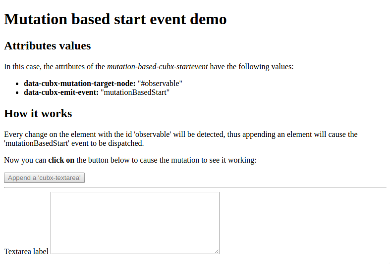
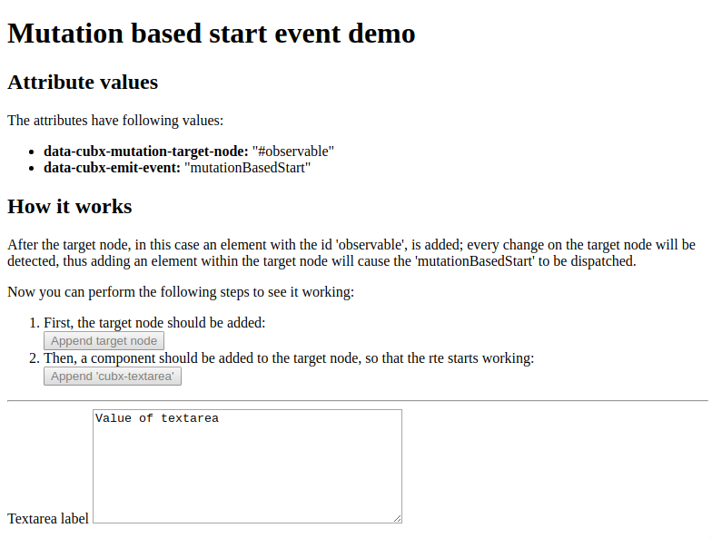

# The Cubbles mutation based start event API

## Purpose

Cubbles allows users to observe the mutations of an HTML node (See [this](https://developer.mozilla.org/en/docs/Web/API/MutationObserver)) and then dispatch an event if a mutation occurs. The mutations that can be observed are the ones corresponding to `{childList: true}`.

The [RTE](../../user-guide/rte/README.md) contains a utility called `mutation-based-cubx-startevent` which contains the following attributes:

1. **data-cubx-target-selector**: to provide a css selector to indicate which node should be observed
2. **data-cubx-emit-event**: to indicate the name of the event, which should be dispatched when a mutation occurs.

It is important to highlight that the only mutation to be observed is the first one that occurs; after that, the event will be dispatched and the observer will be disconnected.

The following sections present a demo to show the proper use of the `mutation-based-cubx-startevent` utility.

## Prerequisites

- We will use the [cubx-textarea](https://cubbles.world/sandbox/com.incowia.basic-html-components@2.0.0-SNAPSHOT/cubx-textarea/docs/index.html) component in our example. Thus, it should be available within the store you are currently using

## Sample case

Let's say say you are building an app where a Cubbles component will be included. The component will be appended to a div container, but you need the Cubbles RTE to start working after this div suffers a mutation. Thus, you need to use the `mutation-based-cubx-startevent.`

## Using the mutation-based-cubx-startevent utility

To use the `mutation-based-cubx-startevent` first we need to:

1. Include it as script within the head of our HTML document
2. Add a root dependency to include the `cubx-textarea` in our page
3. Include the `custom-elements-es5-adapter`, `webcomponents-lite` and the `crc-loader` scripts as usual.
4. Provide a value for the `data-cubx-startevent` within the `crc-loader` script since we want the Cubbles RTE to start working after a mutation occurs

Lets say we want to observe a div, whose id is _observable_. Also, we want an event called _mutationBasedStart_ to be dispatched when the mutation occurs. Therefore, the values of the `mutation-based-cubx-startevent` attributes should be:

| Attribute                 | Value              |
| ------------------------- | ------------------ |
| data-cubx-target-selector | #observable        |
| data-cubx-emit-event      | mutationBasedStart |

### The head element

Using the information presented above, the _head_ element of our app should look similar to the one shown below:

```html
<head>
    <meta charset="UTF-8">
    <title>&lt;cubx-textarea&gt;</title>
    <link rel="stylesheet" type="text/css" href="style.css">
    <script src="https://cubbles.world/sandbox/cubx.core.rte@3.0.0-SNAPSHOT/webcomponents/custom-elements-es5-adapter.js"></script>
    <script src="https://cubbles.world/sandbox/cubx.core.rte@3.0.0-SNAPSHOT/webcomponents/webcomponents-lite.js"></script>
    <script src="https://cubbles.world/sandbox/cubx.core.rte@3.0.0-SNAPSHOT/mutation-based-cubx-startevent/js/mutationBasedCubxStartevent.js"
            data-cubx-target-selector="#observable"
            data-cubx-emit-event="mutationBasedStart"></script>
    <script>
    window.cubx = {
        CRCInit: {
            rootDependencies: [
                {
                    webpackageId: 'com.incowia.basic-html-components@2.0.0-SNAPSHOT',
                    artifactId: 'cubx-textarea'  
                }
            ]
        }
    };
    </script>
    <script src="https://cubbles.world/sandbox/cubx.core.rte@3.0.0-SNAPSHOT/crc-loader/js/main.js" data-crcinit-loadcif="true" data-cubx-startevent="mutationBasedStart"></script>
</head>
```

### The body element

As you can already imagine, the _body_ of our app should have a div container with an id equals to *observable*. That will be enough, however we want our app to explain how our `mutation-based-cubx-startevent` works, so we will also include the following elements:

1. A title for our app
2. A description of the values of the {{mutation-based-cubx-startevent}} attributes
3. A description explaining how the `mutation-based-cubx-startevent` works in this particular case
4. A button to append the component called `cubx-textarea`
5. And a loader to be shown while the Cubbles RTE is working

The code of the body of our app should now look as follows:

```html
<h1>Mutation based start event demo</h1>

<h2>Attributes values</h2>
<p>In this case, the attributes of the <em>mutation-based-cubx-startevent</em> have the following values:</p>
<ul>
    <li><strong>data-cubx-mutation-target-node:</strong> "#observable"</li>
    <li><strong>data-cubx-emit-event:</strong> "mutationBasedStart"</li>
</ul>

<h2>How it works</h2>
<p>
Every change on the element with the id 'observable' will be detected, thus appending an
element will cause the 'mutationBasedStart' event to be dispatched.
</p>
<p>
Now you can <strong>click on</strong> the button below to cause the mutation to see it working:
</p>
<button id="appendComp">Append a 'cubx-textarea'</button>
<hr>
<div class="loader"></div>
<div id="observable"></div>
```

### A script to control behavior

We need a script to:

1. Create and init the `cubx-textarea` component using the [The Cubbles Tag API](../../user-guide/cubbles-tag-api/README.md).
2. Append the `cubx-textarea` component to the _observable_ div after the _appendComp_ button is clicked.
3. Show the _loader_ while the Cubbles RTE is working
4. Hide the _loader_ and show the _observable_ when the component is ready

Our code should look similar to the one shown below:

```html
<script>
(function () {
        'use strict';
        var loader = document.querySelector('.loader');
        var appendComp = document.querySelector('#appendComp');
        var observable = document.querySelector('#observable');

        // Append the cubx-textarea component to the observable div after the appendComp button is clicked.
        appendComp.addEventListener('click', function () {
            observable.appendChild(createTextareaComponent());
            appendComp.setAttribute('disabled', 'disabled');
            loader.style.display = 'block';
        });

        // Hide the loader and show the observable when the component is ready
        document.addEventListener('cifReady', function () {
            loader.style.display = 'none';
            observable.style.display = 'block';
        });

        // Function to Create the cubx-textarea component using the The Cubbles Tag API.
        function createTextareaComponent() {
            var init = document.createElement('cubx-core-init');
            init.style.display = 'none';
            init.appendChild(createSlotInit('label', '"Textarea label"'));
            init.appendChild(createSlotInit('cols', '40'));
            init.appendChild(createSlotInit('rows', '8'));
            var testTextarea = document.createElement('cubx-textarea');
            testTextarea.setAttribute('cubx-webpackage-id', 'com.incowia.basic-html-components@2.0.0-SNAPSHOT');
            testTextarea.appendChild(init);
            return testTextarea;
        }

        // Function to create a cubx-core-slot-init using the The Cubbles Tag API.
        function createSlotInit(slotName, slotValue) {
            var slotInit = document.createElement('cubx-core-slot-init');
            slotInit.setAttribute('slot', slotName);
            slotInit.innerHTML = slotValue;
            return slotInit;
        }
})()
</script>
```

### The style

Now we need to style the _loader_ div, so that it looks like a spinner and let the user know that the component is loading; i.e., the Cubbles RTE is working on getting the component ready. Additionally, we want the _observable_ div to be hidden by default. The style should look as follows:

```css
.loader {
    border: 8px solid #f3f3f3;
    border-radius: 50%;
    border-top: 8px solid #3498db;
    width: 30px;
    height: 30px;
    -webkit-animation: spin 2s linear infinite;
    animation: spin 2s linear infinite;
    display: none;
}

@-webkit-keyframes spin {
0% { -webkit-transform: rotate(0deg); }
100% { -webkit-transform: rotate(360deg); }
}

@keyframes spin {
0% { transform: rotate(0deg); }
100% { transform: rotate(360deg); }
}

#observable{
    display: none;
}
```

### Result

The result of the code above should look as follows:



Check [this demo](https://cubbles.world/sandbox/my-first-webpackage@0.1.0-SNAPSHOT/mutation-based-startevent-demos/index.html) to see the result working online.

## Target node added dynamically

Sometimes you would like to add the target node for the mutation observer dynamically; in that case, the utility `mutation-based-cubx-startevent` will wait until the node is added to the body to observe it for changes.

The only thing should do is to append a target node that matches the css selector provided in the `data-cubx-target-selector` attribute.

### A working example



Check [this demo](https://cubbles.world/sandbox/my-first-webpackage@0.1.0-SNAPSHOT/mutation-based-startevent-demos/dynamic-target-node.html) to see the result working online.