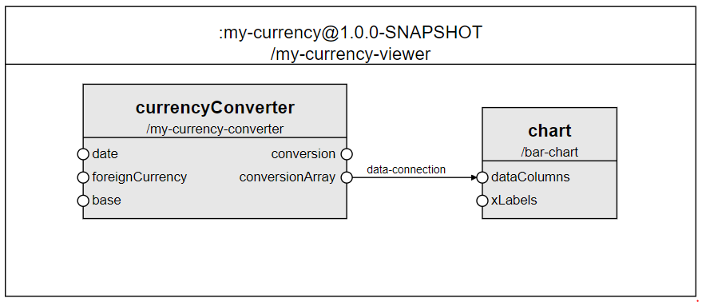
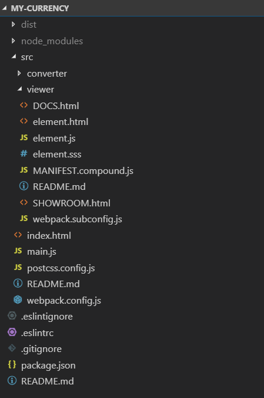
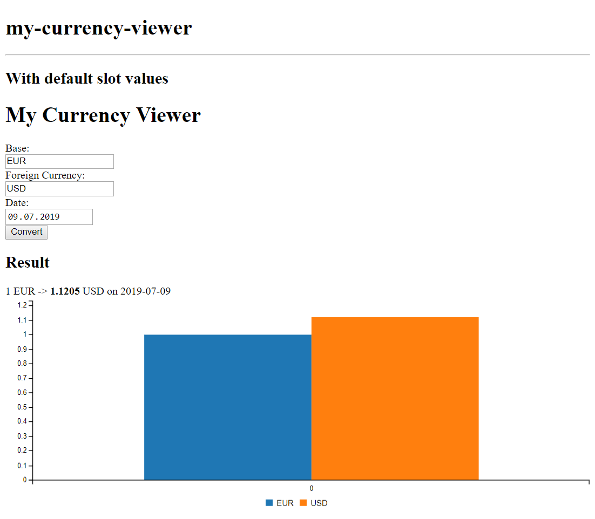

# A compound example

## Purpose

To demonstrate how to create a compound component using the vanilla boilerplate. To aim that, we will take into account the considerations presented [here](./).

## Prerequisites

* A Cubbles Project containing the [`my-currency-viewer`](../developing-elementaries/elementary-sample.md) elementary exists.

> Note that we assume that you are using the [vanilla-boilerplate](https://github.com/cubblesmasters/vanilla), which uses webpack to build the artifacts. Since each type of artifact has its own webpack subconfig; in this tutorial, we assume that the root webpack configuration is the same as in the mentioned boilerplate.

## Creating the my-currency-viewer Compound Component

We will create a compound component called `my-currency-viewer`. This compound will use a chart to display the conversion calculated by the [`my-currency-viewer`](../developing-elementaries/elementary-sample.md) elementary.

### Members description

The `my-currency-viewer` comprises the following members:

| Member Id | Description | Artifact Id | Webpackage Id |
| :--- | :--- | :--- | :--- |
| currencyConverter | Component to calculate conversions between two currencies at a certain date. | my-currency-viewer | `this` |
| chart | Component to visualise the currency conversion data from the `currencyConverter` component using a bar chart. | `bar-chart` | `com.incowia.lib.chart-library@1.0.0` |

### Dataflow of the compound

The dataflow of this compound is shown below:



## The required files of my-currency-viewer

> Remember that our compound component will be created within the same webpackage of the `my-currency-viewer` compound.

To create a compound component on top of the vanilla boilerplate, you can use the sample folder (compound) and edit its content according to your needs. Or, you could create it from scratch. At the end of this tutorial you will end up with the following:

* A folder called _viewer_ containing the files of the compound. The name of this folder will be used as the suffix for the artifactId of this compound. Thus, the artifactId of this component would be _my-currency-viewer_
* A file containing the **manifest definition** of the compound. It has to be called _MANIFEST.compound.js_
* A file containing the **view** of the compound. In this case. We will call it _element.html_
* A file containing the **logic** of the compound. In this case. We will call it _element.js_
* A file containing the **style** of the compound. In this case. We will call it _element.sss_
* A file containing a **demo** for the compound. We will call it _SHOWROOM.html_. You don't need to edit this file for the demo to work properly
* A file containing the **config for webpack** to build elementaries. We will call it _webpack.subconfig.js_. You don't need to edit this file for the compound to build and work properly
* A file containing the **docs** for the compound. We will call it _DOCS.html_. (Not included by default in the boilerplate, check [this](../adding-docs) to know how to generate it).

The image below presents the structure of the project containing the compound:



## The manifest definition of my-currency-viewer (MANIFEST.compound.js file)

You can use javascript to define the manifest of your compound, however, you must assure that at the end it should be a valid Cubbles compound definition (See [this](../../../user-guide/terms-and-concepts/artifacts.md#artifact-definition) for more info). As mentioned above, the manifest should be defined in the _MANIFEST.compound.js_ file, which should be located in the root folder of the compound.

The following code defines the description, resources, runnables, and dependencies of `my-currency-converter`. It is important to include the _element.html_ file as a resource, otherwise the compound would not be available.

The runnables are files that can be "run" from a [Cubbles base](../../../user-guide/), in this case, the demo and the docs files.

```javascript
const assert = require('assert');

module.exports = (webpackageName) => {
  assert.ok(webpackageName, 'Expected "webpackageName" to be defined.')
  return {
    description: "Compound to convert and visualize currency conversions.",
    resources: [
      "element.html"
    ],
    runnables: [
      {
        name: "SHOWROOM",
        path: "/SHOWROOM.html"
      },
      {
        name: "DOCS",
        path: "/DOCS.html"
      }
    ],
  };
};
```

### The dependencies property

As you can see in the dataflow picture above, our compound has two members, the `my-currency-converter` and the `bar-chart` component. To have the resources of the members available, we need to define two dependencies to be loaded at runtime:

#### my-currency-converter

1. webpackageId: it is not necessary since the `my-currency-viewer` implementation is within the same webpackage.
2. artifactId: my-currency-converter.

#### bar-chart

1. webpackageId: `com.incowia.lib.chart-library@01.0.0`, as the `bar-chart` artifact resides within another webpackage. Thus, we should specify the name and version of this webpackage.
2. artifactId: bar-chart.

> Note that the `com.incowia.lib.chart-library@01.0.0` is already available in the [shared](https://cubbles.world/shared/cubx.core.artifactsearch@1.6.1/artifactsearch/index.html) store of the Cubbles platform.

The _dependencies_ property of `my-currency-viewer` should look as follows:

```javascript
// ...
  return {
    // ...
    dependencies: [
      { artifactId: `${webpackageName}-converter` },
      { webpackageId: "com.incowia.lib.chart-library@1.0.0", artifactId: "bar-chart" }
    ],
    // ...
  };
};
```

> Nota that we are using a variable called `webpackageName`_ to set suffix of the artifactId of the `my-currency-converter` artifactId. This variable will be set a building time by webpack. This will assure that the artifactId is always correct, even if we change the name of the package or of the folder containing the elementary.

### The members property

Now, we need to add the _members_ property of our compound as follows:

```javascript
// ...
  return {
    // ...
    members: [
      { artifactId: `${webpackageName}-converter`, memberId: "currencyConverter" },
      { artifactId: 'bar-chart', memberId: "chart" }
    ],
    // ...
  };
};
```

> Note that both members were included as dependencies. Otherwise, the compound component wouldn't be able to identify them.

### The connections property

A connection defines the data to be transferred between 2 slots each from one member. To set up a connection, you need to edit the _connections_ array of the compound component. Add the following code to your manifest to include the `data-connection` connection to the `my-currency-viewer` compound:

```javascript
// ...
  return {
    // ...
    connections: [
      {
        connectionId: 'data-connection',
        source: {
          memberIdRef: 'currencyConverter',
          slot: 'conversionArray'
        },
        destination: {
          memberIdRef: 'chart',
          slot: 'dataColumns'
        }
      }
    ]
  };
};
```

### The slots property

Since our compound doesn't expose any member-slots, just remove the pre-generated slots definition.

### The inits property

The _inits_ property of a compound allows setting an initial value to the slots of the compound component being defined, or to the slots of its members. To read more about compound components initialisation check [this](./compound-init).

We won't initialise any slot for the purpose of this tutorial.

## The template of my-currency-viewer (element.html file)

By default, each member will be rendered as a direct child node of the compound in the order in which it was defined above. However, if you want to render the compound members in a particular way or add other HTML elements, you can provide a custom HTML template. The following is an example of a template for the `my-currency-viewer` component. To aim that, you should edit the `element.html` file as follows:

```html
<template id="<%= elementName %>">
    <h1>My Currency Viewer</h1>
    <<%= webpackageName %>-converter member-id-ref="currencyConverter"></<%= webpackageName %>-converter>
    <bar-chart member-id-ref="chart"></bar-chart>
</template>
```

> Note that the HTML code for your component should be located inside the `<template>` tag. Also, we are using a _templateParameter_ called `elementName`. This parameter will be set a building time by webpack using the [HtmlWebpackPlugin](https://webpack.js.org/plugins/html-webpack-plugin/). This will assure that the artifactId is always correct, even if we change the name of the package or of the folder containing the compound.

### Change the style of elementary \(element.sss File\)

In this tutorial we won't modify the style of our component. However, you can add style definitions in the file element.sss. Using [sugarss](https://github.com/postcss/sugarss). It could also be a CSS style sheet. Then, you can import the style in the _elementary.js_ file.

## The element.js file

Compound components have no associated logic; however, you can use this file to import resources such as the element.sss file and define [hookFunctions](../../../user-guide/cubbles-tag-api/README.md#using-hook-functions).

## The final result

If you run the project and navigate to the _SHOWROOM.html_ file, you will see something similar to:



### Online demo

You can also check the results at the [online demo](https://cubbles.world/sandbox/my-currency@1.0.0-SNAPSHOT/my-currency-viewer/SHOWROOM.html).
