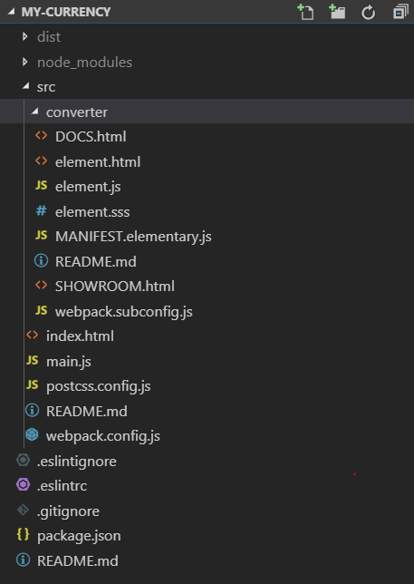

# An elementary example

## Purpose

To demonstrate how to create an elementary component using the vanilla boilerplate. To aim that, we will take into account the considerations presented [here](./README).

## Prerequisites

* A Cubbles Project was [generated](../creating-project) using the _my-currency_ as the package name.

> Note that we assume that you are using the [vanilla-boilerplate](https://github.com/cubblesmasters/vanilla), which uses webpack to build the artifacts. Since each type of artifact has its own webpack subconfig; in this tutorial, we assume that the root webpack configuration is the same as in the mentioned boilerplate.

## Interface of the my-currency-converter elementary

We will create an elementary component called _my-currency-converter_. It is a component that uses [The Foreign exchange rates API](https://exchangeratesapi.io/) to get current and historical foreign exchange rates. This component will have the following interface \(input slots on the left and output slots on the right\):


## The required files of my-currency-converter

To create an elementary component on top of the vanilla boilerplate, you can use the sample folders and edit their content according to your needs. Or, you could create it from scratch. At the end of this tutorial you will end up with the following:

* A folder called _converter_ containing the files of the elementary. The name of this folder will be used as the suffix for the artifactId of this elementary. Thus, the artifactId of this component would be _my-currency-converter_
* A file containing the **manifest definition** of the elementary. It has to be called _MANIFEST.elementary.js_
* A file containing the **view** of the elementary. In this case. We will call it _element.html_
* A file containing the **logic** of the elementary. In this case. We will call it _element.js_
* A file containing the **style** of the elementary. In this case. We will call it _element.sss_
* A file containing a **demo** for the elementary. We will call it _SHOWROOM.html_. You don't need to edit this file for the demo to work properly
* A file containing the **config for webpack** to build elementaries. We will call it _webpack.subconfig.js_. You don't need to edit this file for the elementary to build and work properly
* A file containing the **docs** for the elementary. We will call it _DOCS.html_. (Not included by default in the boilerplate, check [this](../adding-docs) to know hos to generate it).

The image below presents the structure of the project containing the elementary:



## The manifest definition of my-currency-converter

You can use javascript to define the manifest of your elementary, however, you must assure that at the end it should be a valid Cubbles elementary definition (See [this](../../../user-guide/terms-and-concepts/artifacts.md#artifact-definition) for more info). As mentioned above, the manifest should be defined in the _MANIFEST.elementary.js_ file, which should be located in the root folder of the elementary.

The following code defines the description, resources, runnables, and dependencies of `my-currency-converter`. It is important to include the _element.html_ file as a resource, otherwise the elementary would not be available. Similarly, for an elementary to work the _cubxcomponent_ dependency is a must to process it and make it work.

The runnables are files that can be "run" from a [Cubbles base](../../../user-guide/), in this case, the demo and the docs files.

```javascript
const assert = require("assert");

module.exports = webpackageName => {
  assert.ok(webpackageName, 'Expected "webpackageName" to be defined.');
  return {
    description: "Elementary that uses an API to Convert currencies",
    slots: [],
    resources: ["element.html"],
    runnables: [
      {
        name: "SHOWROOM",
        path: "/SHOWROOM.html"
      },
      {
        name: "DOCS",
        path: "/DOCS.html"
      }
    ],
    dependencies: [
      { webpackageId: "cubx.core.rte@3.0.0", artifactId: "cubxcomponent" }
    ]
  };
};

```

### Slot Definitions

Now, we should add the slots that we presented in the interface above. We need three input slots \(foreignCurrency, date, and base\) and two output slots \(conversion and conversionArray\) for the component. Those are defined in the slots array of the manifest definition of the component as follows:

```javascript
  // ...
  return {
    // ...
    slots: [
      {
        slotId: "base",
        description: "Code of the currency to be converted",
        type: "string",
        direction: ["input"],
        value: "EUR"
      },
      {
        slotId: "foreignCurrency",
        description: "Code of the target currency for the conversion",
        type: "string",
        direction: ["input"],
        value: "USD"
      },
      {
        slotId: "date",
        description: "Date to be used for the conversion",
        type: "string",
        direction: ["input"]
      },
      {
        slotId: "conversion",
        description: "Result of the conversion",
        type: "number",
        direction: ["output"]
      },
      {
        slotId: "conversionArray",
        description: "Result of the conversion as an array of the form [ [ \"baseCurrency\", 1 ], [ \"foreignCurrency\", ... ] ]; e.g., [ [ \"EUR\", 1 ], [ \"USD\", 1.121693 ] ]",
        type: "array",
        direction: ["output"]
      }
    ],
    // ...
  };
};
```

### Changing the View of the Elementary \(element.html File\)

Now, we need to change the template of the component to define its view. We need three input fields to provide the needed data for the conversion, a button to trigger the conversion and an output text to show the result. The following HTML code meets these requirements.

```html
<template id="<%= elementName %>">
    <!-- <%= elementName %> -->
    <div>
        <div>
            <label>Base:</label>
        </div>
        <div>
            <input type="text" id="base">
        </div>
        <div>
            <label>Foreign Currency:</label>
        </div>
        <div>
            <input type="text" id="foreign">
        </div>
        <div>
            <label>Date:</label>
        </div>
        <div>
            <input type="date" id="date">
        </div>
        <div>
            <input type="button" value="Convert" id="convertBtn" disabled>
        </div>
    </div>
    <h2>Result</h2>
    <div id="result"></div>
</template>
```

> Note that the HTML code for your component should be located inside the `<template>` tag. Also, we are using a _templateParameter_ called `elementName`. This parameter will be set a building time by webpack using the [HtmlWebpackPlugin](https://webpack.js.org/plugins/html-webpack-plugin/). This will assure that the artifactId is always correct, even if we change the name of the package or of the folder containing the elementary.

To see the effects of this code, you can start the project by running the following command from the project root folder:

```bash
npm run build && npm run start:watch
```

Navigate to [http://localhost:4000/my-currency/my-currency-converter/SHOWROOM.html](http://localhost:4000/my-currency/my-currency-converter/SHOWROOM.html). You should see a webpage like the one presented below:


> Note that the component doesn't do anything because it has no associated behavior.

### Change the Logic of the Elementary \(element.js File\)

The `element.js` file handles the behavior of the component when a slot value is changed. We should modify the implementation to make a request when a user provides the input data and clicks on the `Convert` button. The following code enables that behavior.

```javascript
(function() {
  "use strict";

  CubxComponent({
    is: "/* @echo elementName */",

    /**
     * Manipulate an element’s local DOM when the cubbles framework is initialized and ready to work.
     */
    contextReady: function() {
      this.$.base.setAttribute("value", this.getBase());
      this.$.foreign.setAttribute("value", this.getForeignCurrency());
      let today = new Date();
      this.setDate(today.toISOString().substr(0, 10));
      this.$.date.setAttribute("value", this.getDate());
      this.$.date.setAttribute("max", this.getDate());
      today.setMonth(today.getMonth() - 12);
      this.$.date.setAttribute("min", today.toISOString().substr(0, 10));

      this.sendQuery();

      this.$.convertBtn.addEventListener(
        "click",
        function() {
          this.getFormValuesAndSendQuery();
        }.bind(this)
      );
      this.$.convertBtn.removeAttribute("disabled");
    },

    /**
     * Observe the 'base' slot to update the view of this component and then
     * send the request to the fixer-io api
     * @param {string} newValue - new value of the slot
     */
    modelBaseChanged: function(newValue) {
      // update the view
      this.$.base.setAttribute("value", newValue);
    },
    /**
     * Observe the 'date' slot to update the view of this component and then
     * send the request to the fixer-io api
     * @param {string} newValue - new value of the slot ('yyyy-mm-dd' format)
     */
    modelDateChanged: function(newValue) {
      // update the view
      this.$.date.setAttribute("value", newValue);
    },
    /**
     * Observe the slot 'foreignCurrency' to update the view of this component
     * and then send the request to the fixer-io api.
     * @param {string} newValue - new value of the slot
     */
    modelForeignCurrencyChanged: function(newValue) {
      // update the view
      this.$.foreign.setAttribute("value", newValue);
    },
    /**
     * Observe the slot 'conversion' to update the view of this component
     * @param {string} newValue - new value of the slot
     */
    modelConversionChanged: function(newValue) {
      let resultText;
      if (newValue) {
        // update the view
        resultText = `1 ${this.getBase()} -> <b>${newValue}</b> ${this.getForeignCurrency()} on ${this.getDate()}`
      } else {
        resultText = 'Invalid inputs.'
      }
      this.$.result.innerHTML = resultText;
    },
    /**
     * Update the Component-Model and then send the request
     * to the fixer-io api.
     * @param event
     */
    getFormValuesAndSendQuery: function() {
      // Update the Cubbles component model slots the setters
      this.setBase(this.$.base.value);
      this.setDate(this.$.date.value);
      this.setForeignCurrency(this.$.foreign.value);

      this.sendQuery();
    },

    /**
     * Send the request a to the fixer-io api.
     */
    sendQuery: function() {
      // Makes sure all slots are defined
      if (this.getBase() && this.getForeignCurrency()) {
        var baseUrl = "https://api.exchangeratesapi.io";
        var queryUrl = `${baseUrl}/${this.getDate()}?base=${this.getBase()}&symbols=${this.getForeignCurrency()}`;
        var self = this;

        function processRespond(data) {
          var converted;
          if (data) {
            // Update the Cubbles component model slots using the setters
            converted = data.rates[self.getForeignCurrency()];
          }
          self.setConversion(converted);
          if (converted) {
            self.setConversionArray([
              [self.getBase(), 1],
              [self.getForeignCurrency(), converted]
            ]);
          } else {
            self.setConversionArray([]);
            }
        }

        this.makeRequest(queryUrl, processRespond);
      }
    },

    /**
     * Make the ajax request
     */
    makeRequest: function(queryUrl, processRespond) {
      var xhttp = new XMLHttpRequest();
      xhttp.onreadystatechange = function() {
        if (this.readyState == 4 && this.status == 200) {
          var data = JSON.parse(xhttp.responseText);
          processRespond(data);
        } else {
          processRespond();
        }
      };
      xhttp.open("GET", queryUrl, true);
      xhttp.send();
    }
  });
})();
```

> Note that this property is set by `/* @echo elementName */`, which would be handled by webpack using the [preprocess-loader](https://www.npmjs.com/package/preprocess-loader).

### Change the style of elementary \(element.sss File\)

> For this tutorial we won't modify the style of our component. However, you can add style definitions in the file element.sss. Using [sugarss](https://github.com/postcss/sugarss). It could also be a CSS style sheet. Then, you can import the style in the _elementary.js_ file.

## The final result

If you run the project and navigate to the _SHOWROOM.html_ file, you will see something similar to:


### Online demo

You can also check the results at the [online demo](https://cubbles.world/sandbox/my-currency@1.0.0-SNAPSHOT/my-currency-converter/SHOWROOM.html).
